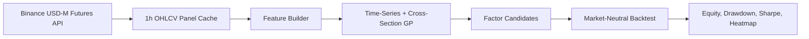

# QuantGplearn

[](https://www.python.org/)
[](https://github.com/WYFHHH/QuantGplearn)
[](LICENSE)
[](QuantGplearn/genetic.py)

QuantGplearn is a genetic-programming research framework for crypto futures
factor mining. It extends the `gplearn` programming style with finance-oriented
time-series operators, cross-section operators, panel-data execution, and
market-neutral backtesting.



## Highlights

- `gplearn`-style estimators: `SymbolicRegressor`, `SymbolicClassifier`, and
  `SymbolicTransformer`.
- Time-series operators for rolling momentum, ranks, correlations, z-scores,
  ATR, MACD, hedge residuals, and more.
- Cross-section operators for panel strategies: `cs_rank`, `cs_zscore`,
  `cs_demean`, `cs_scale`, and `cs_winsorize`.
- Panel execution that can combine time-series operators by symbol with
  cross-section operators by timestamp.
- Binance USD-M perpetual downloader for 10 default high-liquidity contracts.
- Market-neutral cross-section backtester with fees, turnover, drawdowns,
  rolling Sharpe, equal-weight benchmark, and monthly return heatmaps.

## Installation

QuantGplearn targets Python 3.11+ on Linux.

```bash
git clone https://github.com/WYFHHH/QuantGplearn.git
cd QuantGplearn
python -m pip install -e .
```

Runtime dependencies are declared in `setup.py` and include:

```text
numpy, pandas, scipy, scikit-learn, joblib, pathos, numba, requests,
tqdm, dill, matplotlib, seaborn, pyyaml, tables
```

For tests:

```bash
python -m pip install pytest
pytest
```

## Quick Start: Cross-Section GP

Download the default 10-symbol Binance USD-M perpetual panel:

```bash
python example/download_binance_panel.py
```

Default universe:

```text
BTCUSDT, ETHUSDT, BNBUSDT, SOLUSDT, XRPUSDT,
DOGEUSDT, ADAUSDT, AVAXUSDT, LINKUSDT, LTCUSDT
```

Then mine and backtest cross-section GP factors:

```bash
python example/cross_section_gp.py
```

Generated local artifacts are written under `backtest_results/cross_section/`
and are ignored by Git.

If Binance returns HTTP 451 in your region, run from an eligible network or set
standard proxy environment variables before downloading:

```bash
export HTTP_PROXY=http://127.0.0.1:7890
export HTTPS_PROXY=http://127.0.0.1:7890
python example/download_binance_panel.py
```

## Quick Start: Single-Symbol Time-Series GP

The original BTCUSDT time-series example remains available:

```bash
python example/get_factors.py
```

It loads BTCUSDT hourly data from `data/`, trains a small symbolic transformer,
saves selected programs under `example/details/factors/`, and writes example
performance artifacts under `backtest_results/`.

## Function Sets

Core primitives:

```text
add, sub, mul, div, sqrt, log, abs, neg, inv, max, min, sig
```

Time-series operators:

```text
ts_shift, ts_delta, ts_mom, ts_min, ts_max, ts_argmax, ts_argmin,
ts_rank, ts_sum, ts_std, ts_corr, ts_mean, ts_zscore, ts_cdlbodym,
ts_bar_bs, ts_adx, ts_aroon, ts_bopr, ts_cmo, ts_macd, ts_rsi,
ts_stochf, ts_xs_ratio, ts_one_ols_k, ts_one_ols_resid, ts_skew,
ts_kurt, ts_atr, ts_hedge
```

Cross-section operators:

```text
cs_rank, cs_zscore, cs_demean, cs_scale, cs_winsorize
```

Use:

- `functions.all_function` for legacy raw + time-series workflows.
- `functions.section_function` for cross-section-only expressions.
- `functions.panel_function` for panel GP that can mix time-series and
  cross-section logic.

The default integer windows are configured for hourly bars:

```text
24, 72, 168, 336, 504, 720
```

## Data Format

The Binance downloader stores a local HDF5 panel cache:

```text
data/cache/binance_um_perp_1h_panel.h5
```

The table uses a MultiIndex:

```text
datetime, symbol
```

And includes:

```text
open, high, low, close, volume, quote_volume, trade_count,
taker_buy_volume, taker_buy_quote_volume, vwap, close_datetime
```

Full market data is not committed to Git. Rebuild it with:

```bash
python example/download_binance_panel.py --days 365
```

## Project Layout

```text
QuantGplearn/
  functions.py       Protected primitives, time-series ops, cross-section ops
  genetic.py         Symbolic estimators and panel execution
  _program.py        Symbolic program representation
example/
  get_factors.py             Legacy BTCUSDT time-series example
  download_binance_panel.py  Binance futures panel downloader
  cross_section_gp.py        Market-neutral cross-section GP example
utils/
  data/binance_futures.py            Official Binance REST downloader
  backtest_tool/cross_section.py     Cross-section backtest and plots
  backtest_tool/generate_performance.py
tests/
  test_functions.py
  test_panel_program.py
  test_cross_section_backtest.py
  test_binance_downloader.py
```

## Backtest Defaults

- Signal timing: factor at time `t` enters at the next open.
- Return timing: open-to-open forward return after entry.
- Portfolio: market neutral, long top 30%, short bottom 30%.
- Gross exposure: long `+0.5`, short `-0.5`.
- Fee: `3 / 10000` per unit turnover.
- Benchmark: equal-weight forward return across the panel universe.

## FAQ

**Does the downloader require a Binance API key?**
No. It uses public USD-M futures market data endpoints.

**Why does Binance return HTTP 451?**
Binance blocks futures APIs from some regions. QuantGplearn does not bypass
that policy; run the downloader from an eligible network or configure
`HTTP_PROXY` and `HTTPS_PROXY`.

**Are downloaded data files committed?**
No. `data/cache/` and generated cross-section artifacts are ignored.

**Can time-series and cross-section operators appear in one formula?**
Yes. With `data_type="panel"` and `functions.panel_function`, time-series
operators are applied per symbol and cross-section operators are applied per
timestamp.

## Acknowledgements

QuantGplearn is inspired by and adapted from:

- [`gplearn`](https://github.com/trevorstephens/gplearn), the foundational
  symbolic genetic programming project.
- [`gplearnplus`](https://github.com/ACEACEjasonhuang/gplearnplus), a reference
  for extended GP functionality.

## License

This project is released under the MIT License. See `LICENSE` for details.
