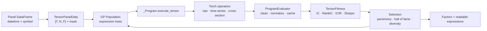

<p align="center">
  
</p>

<h1 align="center">QuantGplearn</h1>

<p align="center">
  <strong>Evolve interpretable quantitative factors. Evaluate them on CPU or GPU. Keep the formula.</strong>
</p>

<p align="center">
  <a href="https://www.python.org/"></a>
  <a href="https://pytorch.org/"></a>
  <a href="https://developer.nvidia.com/cuda-zone"></a>
  <a href="LICENSE"></a>
  <a href="https://github.com/WYFHHH/QuantGplearn/stargazers"></a>
  <a href="https://github.com/WYFHHH/QuantGplearn/commits/main"></a>
</p>

<p align="center">
  <a href="#quick-start">Quick start</a> ·
  <a href="#what-it-does">Features</a> ·
  <a href="#operator-library">Operators</a> ·
  <a href="#architecture">Architecture</a> ·
  <a href="#documentation">Documentation</a>
</p>

---

QuantGplearn is a genetic-programming framework for quantitative factor
research. Instead of fitting an opaque set of weights, it searches for
human-readable expressions built from market features, rolling operators, and
cross-sectional transformations:

```text
cs_rank(ts_zscore(close, 168))
div(ts_delta(vwap, 24), ts_std(close, 72))
cs_demean(ts_one_ols_resid(close, volume, 336))
```

The same symbolic program representation can run through the original
NumPy/Pandas engine or through a Torch tensor backend designed for dense panel
data. The result is a practical bridge between explainable symbolic research
and GPU-accelerated factor evaluation.

> QuantGplearn discovers candidate signals; it is not a promise of investment
> performance. Validate every factor with leakage-aware, out-of-sample
> research and a realistic execution model.

<details>
<summary><strong>中文简介</strong></summary>

QuantGplearn 是一个面向量化因子研究的遗传规划框架。它不输出难以解释的黑盒权重，
而是进化出由行情特征、时序算子和截面算子组成的可读公式。项目同时保留原有
NumPy/Pandas CPU 路径，并提供适用于 `[时间, 标的, 特征]` 面板数据的 Torch/GPU
执行后端，支持 IC、RankIC、ICIR 和多空组合 Sharpe 代理目标，以及因子相关性过滤。

</details>

## Why QuantGplearn?

| Capability | What it gives you |
|---|---|
| **Formula-native research** | Every candidate is an inspectable expression tree, not a hidden parameter vector. |
| **Two execution backends** | Keep the mature NumPy/Pandas workflow or evaluate dense panel expressions with Torch. |
| **Time-series + cross-section semantics** | Mix rolling logic within each security with ranking and normalization across securities. |
| **Finance-aware objectives** | Search with IC, RankIC, ICIR, RankICIR, or a long-short Sharpe proxy. |
| **Diversity controls** | Hall-of-fame ranking and factor-correlation filtering reduce duplicate discoveries. |
| **Research ergonomics** | Scikit-learn-style estimators, warm starts, low-memory mode, score caching, and expression export. |

## What It Does

### Symbolic learning

- `SymbolicRegressor` evolves formulas for continuous prediction.
- `SymbolicClassifier` evolves binary classification formulas.
- `SymbolicTransformer` produces multiple symbolic features on the CPU path.
- `GpuSymbolicTransformer` mines multiple panel factors with Torch execution.

### Genetic search

- `grow`, `full`, and `half and half` population initialization.
- Tournament selection.
- Subtree crossover.
- Subtree, hoist, point, and point-replacement mutation.
- Reproduction of surviving programs.
- A maximum-length evolution guard and parsimony pressure against unnecessarily complex formulas.
- Warm-started evolution and generation-level diagnostics.

### Panel factor evaluation

- Converts a `pandas.DataFrame` into a dense `[T, N, F]` tensor.
- Applies time-series operators along time for each security.
- Applies cross-section operators across securities at each timestamp.
- Carries a validity mask for missing features and targets.
- Cleans non-finite outputs and optionally normalizes each cross-section.
- Caches expression scores and, optionally, factor tensors.

### Factor selection

- Ranks a hall of fame by the chosen research objective.
- Applies best-effort correlation filtering with `tolerable_corr`; if too few
  diverse candidates remain, the strongest candidates fill the requested
  component count.
- Exports factor values as tensors, NumPy arrays, or panel DataFrames.
- Exports rank, score, expression, tree length, and tree depth.
- Provides `TensorFactorCalculator` and `GPAlphaPool` for IC-based factor pools.

## Quick Start

### 1. Install

```bash
git clone https://github.com/WYFHHH/QuantGplearn.git
cd QuantGplearn
python -m pip install -e .
```

QuantGplearn targets Python 3.11+ on Linux. For GPU execution, install the
PyTorch build that matches your CUDA environment before installing the project.

### 2. Build a panel

The GPU API accepts a DataFrame with a `[datetime, symbol]` MultiIndex, or
equivalent ordinary columns:

```python
import numpy as np
import pandas as pd

rng = np.random.default_rng(7)
times = pd.date_range("2024-01-01", periods=256, freq="h")
symbols = [f"asset_{i}" for i in range(12)]
index = pd.MultiIndex.from_product(
    [times, symbols], names=["datetime", "symbol"]
)

returns = rng.normal(0.0, 0.01, size=(len(times), len(symbols)))
close = 100.0 * np.exp(np.cumsum(returns, axis=0))
volume = rng.lognormal(10.0, 0.7, size=close.shape)
target = np.roll(returns, -1, axis=0)
target[-1] = np.nan

panel = pd.DataFrame(
    {
        "close": close.reshape(-1),
        "volume": volume.reshape(-1),
        "target": target.reshape(-1),
    },
    index=index,
)
```

### 3. Evolve factors

```python
from QuantGplearn.gpu_transformer import GpuSymbolicTransformer

model = GpuSymbolicTransformer(
    population_size=256,
    generations=10,
    hall_of_fame=50,
    n_components=8,
    tournament_size=32,
    function_set=[
        "add", "sub", "mul", "div",
        "ts_delta", "ts_mean", "ts_std", "ts_zscore",
        "cs_rank", "cs_demean",
    ],
    feature_names=["close", "volume"],
    objective="icir",
    max_length=20,
    tolerable_corr=0.7,
    device="cuda:0",
    random_state=2025,
    verbose=1,
)

model.fit_panel(panel, target_col="target")

expressions = model.get_factor_expressions()
factors = model.transform_panel(output="dataframe")

print(expressions)
print(factors.tail())
```

If CUDA is unavailable, a CUDA device request falls back to CPU tensor
execution with a warning. This makes the same example useful as a functional
smoke test on a non-GPU machine.

### 4. Use the CPU estimators

The original estimators remain available for conventional tabular symbolic
learning:

```python
from QuantGplearn.genetic import SymbolicTransformer

cpu_model = SymbolicTransformer(
    population_size=1000,
    generations=20,
    hall_of_fame=100,
    n_components=10,
    function_set=["add", "sub", "mul", "div", "sqrt", "log"],
    metric="spearman",
    parsimony_coefficient=0.001,
    random_state=2025,
)

cpu_model.fit(X_train, y_train)
symbolic_features = cpu_model.transform(X_test)
```

## Architecture



### Execution semantics

For an internal tensor with shape `[T, N, F]`:

| Dimension | Meaning | Example operation |
|---|---|---|
| `T` | ordered timestamps | `ts_mean(close, 24)` rolls along time |
| `N` | securities at one timestamp | `cs_rank(factor)` ranks across securities |
| `F` | input feature channels | `close`, `volume`, `vwap`, custom features |

A program returns one `[T, N]` factor tensor. Warm-up periods, missing
observations, and invalid targets are represented through NaNs and a boolean
mask rather than silently becoming valid samples.

## Search Objectives

| Objective | Alias | Interpretation |
|---|---|---|
| `ic` | `pearson` | Mean cross-sectional Pearson correlation with the target. |
| `rank_ic` | `spearman` | Mean cross-sectional rank correlation. |
| `icir` | - | Mean IC divided by IC volatility. |
| `rank_icir` | - | Mean RankIC divided by RankIC volatility. |
| `long_short_sharpe` | `sharpe` | Sharpe proxy for a top-minus-bottom factor portfolio. |

The GPU evaluator can normalize each timestamp's cross-section before scoring.
Expression errors and non-finite scores are converted to neutral scores so one
invalid tree does not stop an evolutionary run.

## Operator Library

The recommended GPU panel preset contains **49 operators**. Torch backends are
registered when `QuantGplearn.torch_functions` is imported.

### Protected mathematical primitives

```text
add  sub  mul  div  sqrt  log  abs  neg  inv  max  min  sig
```

Division, logarithm, square root, inverse, tangent, and ratio-style indicators
use protected or clipped implementations to keep expression trees numerically
closed.

### Time-series operators

| Family | Operators |
|---|---|
| Lag and change | `ts_shift`, `ts_delta`, `ts_mom` |
| Rolling statistics | `ts_min`, `ts_max`, `ts_sum`, `ts_mean`, `ts_std`, `ts_zscore` |
| Rolling position | `ts_argmax`, `ts_argmin`, `ts_rank`, `ts_freq` |
| Relationships | `ts_corr`, `ts_one_ols_k`, `ts_one_ols_resid`, `ts_hedge` |
| Distribution shape | `ts_skew`, `ts_kurt` |
| Price action | `ts_cdlbodym`, `ts_bar_bs`, `ts_xs_ratio`, `ts_bband` |
| Technical indicators | `ts_adx`, `ts_aroon`, `ts_bopr`, `ts_cmo`, `ts_ema`, `ts_macd`, `ts_rsi`, `ts_stochf`, `ts_atr` |

### Cross-section operators

```text
cs_rank  cs_zscore  cs_demean  cs_scale  cs_winsorize
```

### Ready-made sets

```python
from QuantGplearn import functions
from QuantGplearn.torch_functions import GPU_SAFE_PANEL_FUNCTIONS

functions.all_function      # raw + time-series operators
functions.section_function  # cross-section-only operators
functions.panel_function    # raw + time-series + cross-section
GPU_SAFE_PANEL_FUNCTIONS    # recommended 49-operator Torch preset
```

Trigonometric Torch backends for `sin`, `cos`, and `tan` are also registered
and can be selected explicitly, although they are not part of the recommended
default preset.

## Evolution Controls

| Parameter | Purpose |
|---|---|
| `population_size` | Programs evaluated in each generation. |
| `generations` | Maximum evolutionary generations. |
| `tournament_size` | Selection pressure during parent choice. |
| `init_depth` / `init_method` | Shape and diversity of the initial trees. |
| `p_crossover` | Probability of exchanging subtrees between parents. |
| `p_subtree_mutation` | Probability of replacing a subtree. |
| `p_hoist_mutation` | Probability of simplifying a tree by hoisting a subtree. |
| `p_point_mutation` | Probability of replacing compatible functions or terminals. |
| `max_length` | Evolution guard: overlength parents are reproduced instead of being mutated again. |
| `parsimony_coefficient` | Penalty for complexity; `"auto"` is supported. |
| `p_point_replace` | Replacement probability inside point mutation. |
| `warm_start` | Continue evolution from an existing run. |
| `low_memory` | Discard older populations to reduce memory usage. |
| `cache_scores` / `cache_factors` | Reuse repeated expression evaluations. |
| `tolerable_corr` | Maximum accepted mutual factor correlation during selection. |

The probabilities for crossover and the three mutation methods must leave room
for reproduction; their cumulative sum cannot exceed one.

## Result Inspection

`get_factor_expressions()` returns a compact research table:

```text
rank  score  expression  length  depth
```

`transform_panel()` supports:

```python
model.transform_panel(output="tensor")     # list of [T, N] tensors
model.transform_panel(output="numpy")      # flattened [samples, factors]
model.transform_panel(output="dataframe")  # MultiIndex panel DataFrame
```

The estimator also records generation diagnostics in `run_details_`, including
average expression length, average fitness, best fitness, and generation time.

## Alpha Pool Utilities

For workflows that build a factor library incrementally:

```python
from QuantGplearn.alpha_pool import GPAlphaPool, TensorFactorCalculator

calculator = TensorFactorCalculator(
    model.tensor_data_,
    normalize=True,
    cache_factors=True,
)

pool = GPAlphaPool(
    capacity=20,
    calculator=calculator,
    ic_lower_bound=0.01,
    mutual_ic_upper_bound=0.7,
)

pool.update(list(model))
records = pool.to_records()
```

The pool scores single-factor IC, rejects factors that are too correlated with
existing members, and keeps the strongest expressions up to its capacity.

## Extending the Framework

### Custom CPU function

Use `make_function` to add a numerically closed vector operator:

```python
import numpy as np
from QuantGplearn.functions import make_function

def signed_square(x):
    x = np.asarray(x, dtype=float)
    return np.sign(x) * x**2

signed_square_fn = make_function(
    function=signed_square,
    name="signed_square",
    arity=1,
)
```

### Add a Torch implementation

A custom `_Function` can participate in GPU evolution after attaching a Torch
callable with matching semantics:

```python
import torch

def torch_signed_square(x):
    return torch.sign(x) * x**2

signed_square_fn.torch_function = torch_signed_square

model = GpuSymbolicTransformer(
    function_set=["add", "sub", signed_square_fn],
    feature_names=feature_names,
)
```

Custom CPU fitness functions can be created with
`QuantGplearn.fitness.make_fitness`. The GPU path uses `TensorFitness`
objectives from `QuantGplearn.tensor_fitness`.

## CPU and GPU Paths

| | NumPy/Pandas path | Torch path |
|---|---|---|
| Main API | `SymbolicRegressor`, `SymbolicClassifier`, `SymbolicTransformer` | `GpuSymbolicTransformer` |
| Typical data | arrays or panel DataFrames | panel DataFrames / dense tensors |
| Parallel model | joblib/pathos CPU workers | one Torch device per estimator |
| Time-series operators | grouped by security | tensor time dimension |
| Cross-section operators | grouped by timestamp | tensor security dimension |
| Best use | compatibility, custom CPU research, smaller workloads | dense panel evaluation and GPU-oriented factor mining |

## Current Limitations

- The GPU estimator evaluates a population serially on one Torch device; it is
  not yet a distributed multi-GPU trainer.
- `max_samples` and `n_jobs` are retained in the GPU estimator signature for
  API compatibility but are not yet applied by its evaluator.
- Dense `[T, N, F]` panels can be memory intensive when the source panel is
  highly sparse or unbalanced.
- Rolling operators based on `torch.unfold` may create large intermediate
  tensors for long histories and windows.
- GPU rank tie handling and a few NaN edge cases can differ slightly from
  Pandas semantics.
- The GPU path currently focuses on numeric factors and does not support the
  legacy category-return function system.
- `long_short_sharpe` is a fast training proxy, not a replacement for a
  realistic portfolio backtest.

These constraints are documented deliberately so research results are easier
to interpret and future contributions have clear targets.

## Project Layout

```text
QuantGplearn/
├── genetic.py          # CPU symbolic estimators and genetic evolution
├── _program.py         # expression-tree representation and execution
├── functions.py        # NumPy/Pandas primitives and operator metadata
├── gpu_transformer.py  # GPU panel factor-mining estimator
├── tensor_data.py      # DataFrame <-> [T, N, F] tensor conversion
├── torch_functions.py  # Torch implementations of factor operators
├── tensor_fitness.py   # IC, RankIC, ICIR, and Sharpe objectives
├── evaluator.py        # cleaning, normalization, evaluation, and caches
└── alpha_pool.py       # IC and mutual-correlation factor pool
```

The public repository contains the reusable framework, its documentation, and
framework-level tests. Proprietary datasets, mined strategies, and private
research workflows are intentionally outside the repository.

## Testing

```bash
python -m pip install pytest
pytest -q
```

The GPU transformer smoke test runs on CPU tensors when CUDA is unavailable.

## Documentation

- [GPU factor mining guide](docs/GPU_FACTOR_MINING.md)
- [Optimized operator integration](docs/OPTIMIZED_OPERATORS.md)
- [CPU/GPU refactor summary](docs/REFACTOR_SUMMARY.md)

## Roadmap

- Chunked and batched expression evaluation.
- Multi-GPU evaluator workers.
- Lower-memory rolling kernels for long panels.
- More exact CPU/GPU parity for rank ties and missing-value edges.
- Weight optimization for multi-factor alpha pools.
- Expanded tests and reproducible performance benchmarks.

Contributions that improve numerical correctness, execution efficiency, or
research reproducibility are welcome.

## Acknowledgements

QuantGplearn is inspired by and adapted from:

- [gplearn](https://github.com/trevorstephens/gplearn)
- [gplearnplus](https://github.com/ACEACEjasonhuang/gplearnplus)

## License

QuantGplearn is released under the [MIT License](LICENSE).
